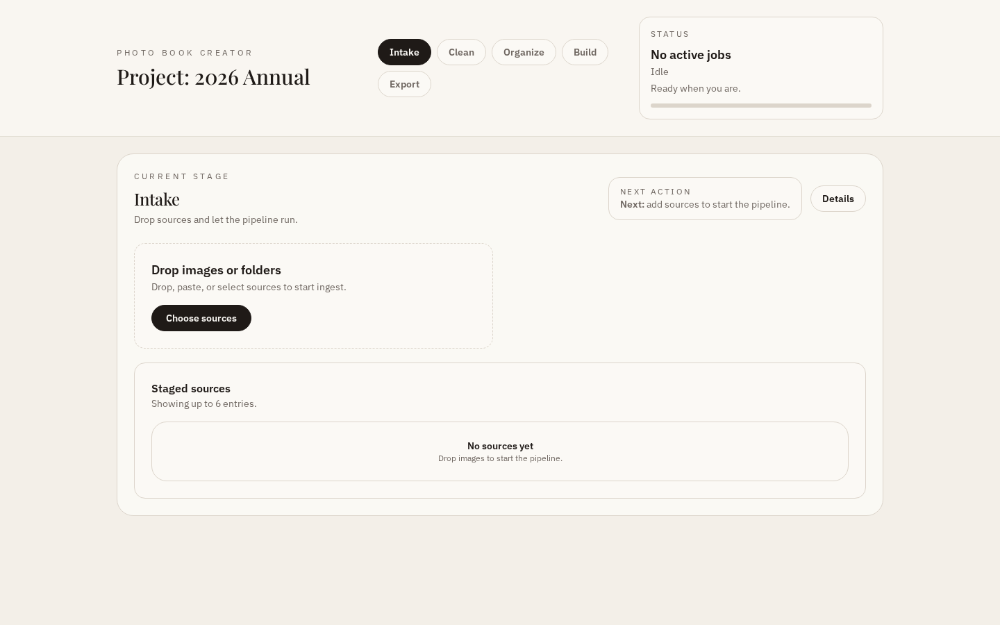
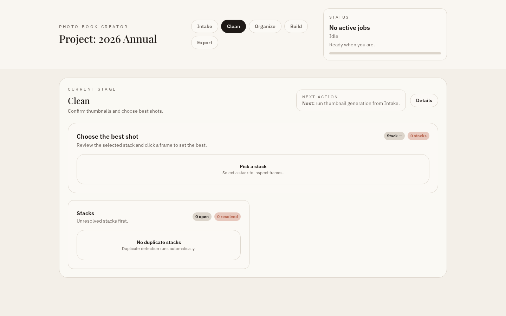
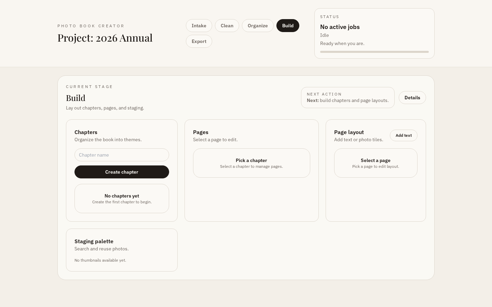

# Photo Book Creator

Local-first tooling to ingest photos, generate thumbnails, and manage project data for clustering, dedupe, scoring, and layout.

## Current Status

- CLI supports thumbnail generation with SQLite metadata storage.
- FastAPI backend supports ingest, background jobs, and chapter/page management.
- React/Vite UI in `ui/` provides a guided, stage-based workflow.

## User Stories

1. Intake and sources: drag/drop folders, single photos, and URLs without reorganizing originals.
2. Non-destructive processing: originals stay in place; background jobs run with progress.
3. Cross-source clustering: events/themes grouped across devices and folders.
4. Duplicate stacks and best shots: review stacks and mark best shots quickly.
5. Staging area: pull photos across themes while building pages.
6. Book structure and pages: create chapters, reorder, set page counts, and place photos.
7. Reuse and text: reuse photos and add text elements to pages.
8. Preview and export: export a structured list of photos/text by page.

## Requirements

- Python 3.10+
- Node 18+
- uv (Python package manager)
- gh (GitHub CLI)
- podman (for trufflehog secrets scan)

## Install

```bash
uv sync --extra dev
```

```bash
cd ui
npm install
```

## Run the API

```bash
uv run photobook-thumbnails --serve
```

API runs on `http://127.0.0.1:8000`.

Local data lives under `.photobook-temp/` (SQLite DB, uploads, thumbnail cache, model cache).

## Run the UI

```bash
cd ui
npm run dev
```

The UI proxies `/api` to the local API server.

## CLI Thumbnail Pipeline

Generate thumbnails and persist metadata in SQLite:

```bash
uv run photobook-thumbnails path/to/photos --cache-dir .cache/thumbnails --sizes 256 1024
```

## API Endpoints (Current)

- `POST /api/ingest` upload photos, enqueue thumbnail + cluster jobs
- `GET /api/thumbnail?path=...` return a cached thumbnail
- `GET /api/thumbnails` list thumbnail records
- `GET /api/clusters` list time-based clusters
- `GET /api/duplicates` list duplicate groups
- `POST /api/duplicates/ignore` ignore a duplicate group
- `POST /api/duplicates/ignore-photo` ignore a single photo
- `POST /api/duplicates/delete` delete assets for a duplicate group
- `POST /api/duplicates/delete-photo` delete assets for a single photo
- `POST /api/duplicates/resolve` set resolved state on a group
- `GET /api/scores` list aesthetic scores
- `GET /api/chapters` list chapters
- `POST /api/chapters` create chapter
- `PATCH /api/chapters/{chapter_id}` rename chapter
- `POST /api/chapters/reorder` reorder chapters
- `POST /api/chapters/{chapter_id}/pages` sync page count
- `GET /api/chapters/{chapter_id}/pages` list pages
- `GET /api/pages/{page_id}/items` list page items
- `POST /api/pages/{page_id}/items` create page item
- `PATCH /api/pages/items/{item_id}` update page item
- `POST /api/export` export chapters/pages payload
- `GET /api/jobs/{job_id}` job status
- `POST /api/cluster` enqueue cluster job
- `POST /api/dedupe` enqueue dedupe job
- `POST /api/score` enqueue scoring job

## UI Screenshots





## Update Screenshots

Make sure the UI is running at `UI_BASE_URL` (default `http://127.0.0.1:4173`).

```bash
cd ui
npm run screenshots
```

## Run Tests

```bash
uv run --extra dev pytest
```

```bash
cd ui
npm run test
```

## Pre-Push Checks

This repo ships a pre-push hook that runs:

- trufflehog secrets scan (via podman)
- ruff
- UI lint

To install the hook:

```bash
ln -sf ../../scripts/pre-push.sh .git/hooks/pre-push
```

## Repo Structure

- `src/photobook/`: backend modules (thumbnails, API, SQLite store)
- `tests/`: integration tests
- `ui/`: React/Vite UI
- `scripts/`: repo automation helpers
- `step-*.md`: project workflow steps (migration in progress)
